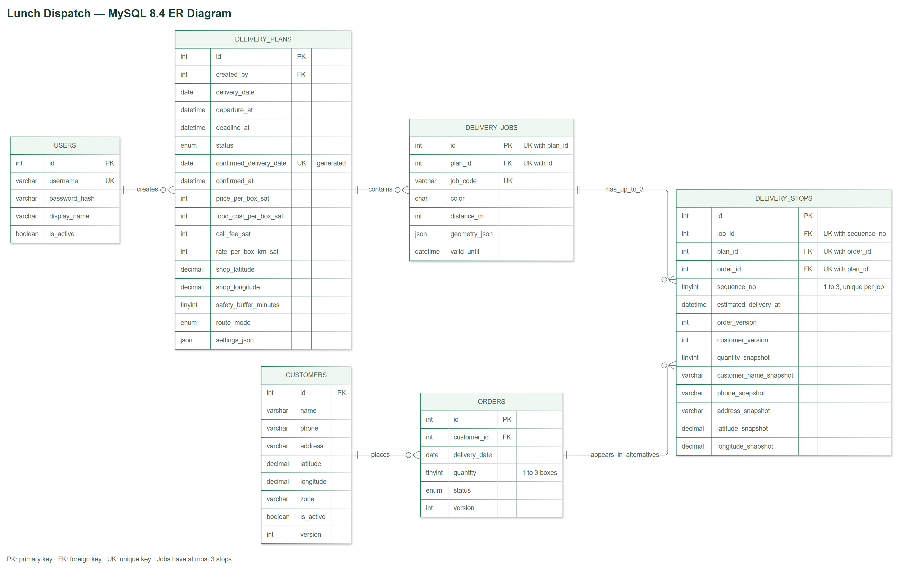

# ออกแบบฐานข้อมูล MySQL — เที่ยงไว · Lunch Dispatch

แบบนี้ใช้ **MySQL 8.4 + InnoDB + utf8mb4** สำหรับมินิโปรเจกต์ Angular และ Express มี 6 ตารางหลัก รองรับลูกค้า ออเดอร์ แผนหลายทางเลือก และใบงานไรเดอร์ โดย Angular เรียก API ของ backend และ backend ติดต่อ MySQL บน Server

เอกสารนี้ใช้แทนส่วนฐานข้อมูล SQLite ในแบบเดิม ยังไม่ได้เชื่อม frontend กับฐานข้อมูลจริง และยังไม่มี backend ที่รันได้

## ไฟล์ที่ใช้

| ไฟล์ | ใช้ทำอะไร |
|---|---|
| [schema.sql](schema.sql) | สร้างฐานข้อมูล 6 ตารางและ 2 views สำหรับสรุป |
| [seed.sql](seed.sql) | ลูกค้าสมมติ 3 คน และออเดอร์วันนี้ 3 รายการ รวม 6 กล่อง |
| [example-queries.sql](example-queries.sql) | ตัวอย่างอ่านออเดอร์ เปรียบเทียบต้นทุน และค้นหาใบงาน |
| [er-diagram.png](er-diagram.png) | ภาพ ER Diagram สำหรับใส่รายงาน |
| [er-diagram.svg](er-diagram.svg) | ภาพเวกเตอร์สำหรับขยายหรือพิมพ์ |
| [er-diagram.mmd](er-diagram.mmd) | ซอร์ส Mermaid สำหรับแก้แผนภาพ |

## ER Diagram



ภาพแสดงฟิลด์หลัก ไม่รวม created_at/updated_at ทุกจุด ดูชนิดข้อมูลเต็มและ constraints ใน `schema.sql`

- **PK** = Primary Key เลขประจำแถว ไม่ซ้ำ
- **FK** = Foreign Key เลขที่อ้างถึงข้อมูลอีกตาราง
- **UK** = Unique Key ค่าหรือชุดค่าที่ห้ามซ้ำ
- ขีดคู่ในความสัมพันธ์หมายถึง 1 ส่วนวงกลมกับขาสามแฉกหมายถึง 0 ถึงหลายรายการ
- `has_up_to_3` เป็นข้อจำกัดธุรกิจ ภาพใช้สัญลักษณ์หลายรายการทั่วไป ส่วน SQL บังคับสูงสุด 3 จุดจริง
- `delivery_stops.plan_id` อยู่ใน FK ชุด `(job_id, plan_id)` ที่อ้างถึง `delivery_jobs` ไม่ได้เป็น FK เดี่ยวไป `delivery_plans`

ความสัมพันธ์อ่านเป็นประโยคได้ดังนี้:

| ความสัมพันธ์ | ความหมาย |
|---|---|
| users 1 → หลาย delivery_plans | เจ้าของหรือพนักงานหนึ่งคนสร้างแผนได้หลายครั้ง |
| customers 1 → หลาย orders | ลูกค้าหนึ่งคนสั่งได้หลายวันหรือหลายครั้ง |
| delivery_plans 1 → หลาย delivery_jobs | แผนหนึ่งแบ่งออกเป็นหลายใบงาน |
| delivery_jobs 1 → หลาย delivery_stops | ใบงานหนึ่งมีจุดส่ง 1–3 จุดเมื่อแผนสมบูรณ์ |
| orders 1 → หลาย delivery_stops | ออเดอร์เดียวปรากฏในแผนทางเลือกได้หลายฉบับ แต่ไม่ซ้ำในแผนเดียวกัน |

**ไรเดอร์หนึ่งคนรับหนึ่งใบงาน** สำหรับขอบเขตนี้ ไม่ต้องมีตารางสมัครสมาชิกไรเดอร์ เพราะใช้เลขใบงานเข้าดูงาน ถ้าภายหลังต้องเก็บชื่อไรเดอร์หรือประวัติการทำงาน จึงเพิ่ม `riders` และ `delivery_jobs.rider_id`

## 1. users — บัญชีเจ้าของร้านและพนักงาน

| ฟิลด์หลัก | ชนิดข้อมูล | ความหมาย |
|---|---|---|
| id | INT UNSIGNED, PK | เลขบัญชี |
| username | VARCHAR(50), UK | ชื่อเข้าใช้ ห้ามซ้ำ |
| password_hash | VARCHAR(255) | ผล hash รหัสผ่านที่ backend สร้าง |
| display_name | VARCHAR(100) | ชื่อที่แสดง |
| is_active | BOOLEAN | ยังใช้บัญชีได้หรือไม่ |

ไม่มีตาราง role สำหรับงานนี้ เพราะทุกบัญชีในตารางเป็นผู้จัดการร้าน ไรเดอร์ใช้เลขใบงานผ่าน API แยกกัน `seed.sql` ไม่สร้างบัญชีพร้อมรหัสผ่าน ให้ backend สร้าง password hash ก่อนเพิ่มบัญชีจริง

## 2. customers — ข้อมูลลูกค้า

| ฟิลด์หลัก | ชนิดข้อมูล | ความหมาย |
|---|---|---|
| id | INT UNSIGNED, PK | เลขลูกค้า |
| name | VARCHAR(100) | ชื่อลูกค้า |
| phone | VARCHAR(20) | เบอร์โทร เก็บเป็นข้อความเพื่อรักษาเลข 0 นำหน้า |
| address | VARCHAR(500) | ที่อยู่และคำแนะนำจุดส่ง |
| latitude / longitude | DECIMAL(10,7) | พิกัดบ้าน |
| zone | VARCHAR(100), NULL ได้ | ชื่อโซน สำหรับหน้าจอปัจจุบัน |
| is_active | BOOLEAN | ปิดใช้งานแทนลบประวัติ |
| version | INT UNSIGNED | เริ่ม 1 เพิ่มทุกครั้งที่แก้ข้อมูล |

ไม่บังคับเบอร์โทรไม่ซ้ำ เพราะครอบครัวหรือสำนักงานอาจใช้เบอร์เดียวกัน พิกัดเก็บด้วย DECIMAL เพื่อกำหนดจำนวนหลักแน่นอน ([MySQL DECIMAL](https://dev.mysql.com/doc/refman/8.4/en/fixed-point-types.html))

## 3. orders — ออเดอร์

| ฟิลด์หลัก | ชนิดข้อมูล | ความหมาย |
|---|---|---|
| id | INT UNSIGNED, PK | เลขออเดอร์ |
| customer_id | INT UNSIGNED, FK | ลูกค้าผู้สั่ง |
| delivery_date | DATE | วันที่ต้องส่ง |
| quantity | TINYINT UNSIGNED | จำนวนอาหาร 1–3 กล่อง |
| status | ENUM | PENDING / ASSIGNED / DELIVERED / CANCELLED |
| version | INT UNSIGNED | เริ่ม 1 เพิ่มเมื่อแก้ออเดอร์ |

ไม่เพิ่มตารางเมนูและ order_items เพราะโจทย์คิดราคาเดียวต่อกล่อง หากต้องเลือกเมนูหรือราคาแตกต่างกันค่อยขยายภายหลัง

สถานะที่ใช้:

```text
PENDING → ASSIGNED → DELIVERED
    └──→ CANCELLED
```

PENDING = รอจัดงาน, ASSIGNED = ยืนยันแผนแล้ว, DELIVERED = ส่งแล้ว, CANCELLED = ยกเลิก สำหรับต้นแบบปัจจุบันยังไม่มีปุ่มรายงานส่งสำเร็จ backend สามารถรองรับ DELIVERED ภายหลังได้

## 4. delivery_plans — แผนและค่าที่ใช้คำนวณ

| ฟิลด์หลัก | ชนิดข้อมูล | ความหมาย |
|---|---|---|
| id | INT UNSIGNED, PK | เลขแผน |
| created_by | INT UNSIGNED, FK | บัญชีผู้สร้างแผน |
| delivery_date | DATE | วันส่ง |
| departure_at / deadline_at | DATETIME | ออก 11:30 และกำหนดถึง 12:30 ของวันส่ง |
| status | ENUM | DRAFT / CONFIRMED |
| confirmed_at | DATETIME, NULL ได้ | เวลาเจ้าของยืนยัน |
| confirmed_delivery_date | DATE, generated, UK | MySQL คำนวณเพื่อจำกัดแผนที่ยืนยันวันละหนึ่งแผน |
| price_per_box_sat | INT UNSIGNED | ราคาขาย เริ่ม 6500 สตางค์ |
| food_cost_per_box_sat | INT UNSIGNED | ต้นทุนอาหาร เริ่ม 4000 สตางค์ |
| call_fee_sat | INT UNSIGNED | ค่าเรียกไรเดอร์ เริ่ม 1500 สตางค์ต่อใบงาน |
| rate_per_box_km_sat | INT UNSIGNED | ค่าส่ง เริ่ม 200 สตางค์/กล่อง/กม. |
| shop_latitude / shop_longitude | DECIMAL(10,7) | สำเนาพิกัดร้านในแผน |
| safety_buffer_minutes | TINYINT UNSIGNED | เวลาเผื่อ เริ่ม 5 นาที |
| route_mode | ENUM | APPROXIMATE / ROAD |
| settings_json | JSON | ค่าคำนวณอื่นและชื่ออัลกอริทึม |

ตัวอย่าง `settings_json` ที่ backend บันทึก:

```json
{
  "speedKmh": 30,
  "handoffMinutes": 2,
  "maxRadiusKm": 3,
  "includeReturnToShop": false,
  "algorithm": "greedy-merge-v1",
  "alternativeSeed": 0
}
```

ฟิลด์จำนวนเงินแยกคอลัมน์เพื่อ query ได้ง่าย ค่าที่เหลือซึ่งไม่ใช้ค้นหาบ่อยเก็บ JSON เฉพาะจุด เมื่อยืนยันแผนแล้ว backend ห้ามแก้ค่าคำนวณและรายการจุดส่ง เพื่อรักษาประวัติ

แผน DRAFT มี `confirmed_delivery_date = NULL` จึงมีหลายแผนได้ เมื่อเป็น CONFIRMED คอลัมน์จะกลายเป็นวันส่ง และ UNIQUE จะห้ามยืนยันแผนที่สองของวันเดียวกัน Backend ไม่ต้องกรอกคอลัมน์ generated นี้เอง ([Generated columns ของ MySQL](https://dev.mysql.com/doc/refman/8.4/en/create-table-generated-columns.html))

ขอบเขตแรกมีหนึ่งรอบส่งต่อวัน หากเพิ่มรอบเช้าหรือเย็น ต้องเพิ่ม delivery_round และปรับ unique ให้แยกตามวันกับรอบ

## 5. delivery_jobs — ใบงานและเส้นทาง

| ฟิลด์หลัก | ชนิดข้อมูล | ความหมาย |
|---|---|---|
| id | INT UNSIGNED, PK | เลขภายในฐานข้อมูล |
| plan_id | INT UNSIGNED, FK | ใบงานนี้อยู่ในแผนใด |
| job_code | VARCHAR(32), UK | รหัสให้ไรเดอร์กรอก |
| color | CHAR(7) | เช่น #D97058 |
| distance_m | INT UNSIGNED | ระยะทั้งใบงาน หน่วยเมตร |
| geometry_json | JSON, NULL ได้ | เส้นทางสำหรับวาดแผนที่ |
| valid_until | DATETIME | วันหมดอายุเลขใบงาน |

backend สร้าง job_code แบบสุ่ม ไม่ใช้เลข id เรียงกัน ปรับรหัสที่ผู้ใช้กรอกให้ตรงรูปแบบเดียวกับรหัสที่ออกให้ การใช้ collation ascii_bin ทำให้รหัสแยกตัวพิมพ์ใหญ่/เล็ก

จำนวนออเดอร์ จำนวนกล่อง และค่าส่งอ่านจาก `v_job_summary` จึงไม่ต้องเก็บยอดซ้ำและคอยแก้หลายตาราง รูปแบบ geometry แนะนำ GeoJSON ซึ่งพิกัดเป็น `[longitude, latitude]` ต้องแปลงลำดับเมื่อนำไปใช้กับ Leaflet

## 6. delivery_stops — ลำดับจุดส่งและสำเนาข้อมูล

| ฟิลด์หลัก | ชนิดข้อมูล | ความหมาย |
|---|---|---|
| id | INT UNSIGNED, PK | เลขจุดส่ง |
| job_id / plan_id | INT UNSIGNED, composite FK | ใบงานและแผนต้องเป็นคู่ที่ตรงกัน |
| order_id | INT UNSIGNED, FK | ออเดอร์ที่จุดนี้ส่ง |
| sequence_no | TINYINT UNSIGNED | ลำดับ 1 / 2 / 3 |
| estimated_delivery_at | DATETIME | เวลาคาดว่าส่งมอบเสร็จที่จุดนี้ |
| order_version / customer_version | INT UNSIGNED | เวอร์ชันต้นทางตอนคำนวณ |
| quantity_snapshot | TINYINT UNSIGNED | จำนวนกล่องตอนคำนวณ |
| customer_name_snapshot / phone_snapshot / address_snapshot | VARCHAR | สำเนาชื่อ เบอร์ และที่อยู่ |
| latitude_snapshot / longitude_snapshot | DECIMAL(10,7) | สำเนาพิกัด |

ทำไมต้องเก็บ snapshot: วันนี้คุณ A รับของที่หอพัก วันถัดไปย้ายบ้าน เมื่อแก้ข้อมูลใน customers ใบงานของวันนี้ยังต้องแสดงที่อยู่เดิม

`plan_id` ใน stops เป็นค่าซ้ำที่ตั้งใจเก็บเพื่อบังคับ UNIQUE `(plan_id, order_id)` ส่วน composite FK `(job_id, plan_id)` ป้องกันการใส่ plan_id ผิดจากใบงานนั้น การใช้ FK ชุดนี้อ้างถึง unique `(id, plan_id)` ของ jobs ([MySQL Foreign Keys](https://dev.mysql.com/doc/refman/8.4/en/create-table-foreign-keys.html))

## กฎไหนฐานข้อมูลบังคับ กฎไหน backend ต้องตรวจ

| กฎ | บังคับที่ไหน |
|---|---|
| ออเดอร์มี 1–3 กล่อง | CHECK quantity |
| Snapshot มี 1–3 กล่อง | CHECK quantity_snapshot |
| ใบงานมีจุดส่งสูงสุด 3 จุด | CHECK sequence_no 1–3 + UNIQUE (job_id, sequence_no) |
| ออเดอร์ไม่ซ้ำในแผนเดียวกัน | UNIQUE (plan_id, order_id) |
| เลขใบงานไม่ซ้ำทั้งระบบ | UNIQUE job_code |
| หนึ่งวันยืนยันได้หนึ่งแผน | Generated date + UNIQUE |
| จุดส่งอ้างถึงแผนของใบงานถูกต้อง | Composite FK |
| ห้ามลบลูกค้าที่มีออเดอร์ | FK RESTRICT ใช้ is_active แทน |
| ลูกค้าอยู่ในรัศมีร้าน 3 กม. | backend คำนวณจากพิกัด |
| ออเดอร์ทั้งหมดของวันนั้นอยู่ในแผนครบ | backend ตรวจชุด id ไม่ใช่แค่จำนวน |
| วันที่ของออเดอร์ตรงกับแผน | backend |
| ใบงานมีอย่างน้อย 1 จุด ลำดับไม่ข้าม และ ETA เรียงเพิ่ม | backend |
| ส่งทันกำหนดและเวลาที่เผื่อไว้ | backend ตรวจทุก ETA |
| ใบงานไม่หมดอายุและเป็นแผนที่ยืนยันแล้ว | backend ตอนค้นหา |
| ป้องกันแก้แผน/ออเดอร์ที่มอบหมายแล้ว | backend ตรวจสถานะ |
| ยืนยันแผนที่ข้อมูลยังไม่เปลี่ยน | backend ตรวจ version และ snapshot ใน transaction |

CHECK ของ MySQL ตรวจค่าของแถว จึงไม่ใช้แทนการตรวจข้ามตารางหรืออัลกอริทึมส่งทันเวลา ([MySQL CHECK Constraints](https://dev.mysql.com/doc/refman/8.4/en/create-table-check-constraints.html))

## ยืนยันแผนอย่างไรให้ไม่ส่งงานซ้ำ

ให้ API ยืนยันทำใน transaction เดียว:

1. `START TRANSACTION`
2. ล็อกแผนเป้าหมายด้วย `SELECT ... FOR UPDATE` ตรวจว่าเป็น DRAFT ถ้ายืนยันแล้วให้คืนแผนเดิมโดยไม่สร้างงานใหม่
3. อ่านและล็อกออเดอร์ที่ไม่ยกเลิกของวันนั้น รวม ASSIGNED/DELIVERED หากพบให้ปฏิเสธการยืนยันแผนใหม่ ล็อกตาม id เรียงกัน
4. ล็อกลูกค้าที่เกี่ยวข้องตาม id ตรวจว่าเปิดใช้ version และข้อมูลยังตรง snapshot
5. ตรวจว่าแผนครอบคลุมชุดออเดอร์ที่ต้องส่งครบ ตรวจวัน จำนวน จุดส่ง ETA geometry และความถูกต้องของค่าคำนวณ
6. ตั้งแผนเป็น CONFIRMED พร้อม confirmed_at และเปลี่ยนออเดอร์เป็น ASSIGNED โดยเพิ่ม version
7. `COMMIT` ถ้าไม่ผ่านข้อใด `ROLLBACK` และคืนข้อผิดพลาด เช่น `409 Conflict`

API เพิ่มหรือแก้ออเดอร์และแก้ลูกค้าต้องใช้กติกาล็อกเดียวกัน เพื่อป้องกันการแก้คั่นระหว่างตรวจและยืนยัน สำหรับมินิโปรเจกต์ร้านเดียว ใช้ `GET_LOCK('lunch_dispatch_dispatch_write', 5)` ที่ทุก API เขียนข้อมูลเหล่านี้ร่วมกันก่อนเริ่ม transaction ตรวจว่าผลเป็น 1 จึงทำต่อ ใช้ connection เดิมตลอด และเรียก `RELEASE_LOCK` ใน finally ก่อนคืน connection เข้า pool การตรวจ version อย่างเดียวไม่ได้ป้องกันออเดอร์ใหม่ที่เพิ่มพร้อมกัน และ COMMIT/ROLLBACK ไม่ได้ปล่อย advisory lock ให้อัตโนมัติ ([MySQL Locking Functions](https://dev.mysql.com/doc/refman/8.4/en/locking-functions.html))

เมื่อ SQL ได้ duplicate-key จากการยืนยันวันซ้ำ ให้ backend จัดการเป็น conflict หากเกิด deadlock ให้ rollback และจัดการ retry ทั้ง transaction ตามกติกาของแอป

## ค่าส่ง กำไร และยอดรวม

เก็บเงินเป็น **สตางค์** และระยะทางเป็น **เมตร** เพื่อให้ตรงกับแบบ backend เดิม:

```text
ค่าส่งใบงาน (สตางค์)
= call_fee_sat
  + ROUND(rate_per_box_km_sat × จำนวนกล่องในใบงาน × distance_m / 1000)

กำไรประมาณการ (สตางค์)
= จำนวนกล่อง × price_per_box_sat
  − จำนวนกล่อง × food_cost_per_box_sat
  − ผลรวมค่าส่งทุกใบงาน
```

ปัดค่าส่งเป็นสตางค์ต่อใบงานก่อนนำมารวม views ใช้ชนิด signed สำหรับกำไรเพื่อรองรับค่าติดลบ

ตัวอย่าง 6 กล่อง วิ่ง 2 กม.:

| รายการ | ผลลัพธ์ |
|---|---:|
| รายได้ 6 × 65 | 390 บาท |
| ต้นทุนอาหาร 6 × 40 | 240 บาท |
| ค่าส่ง 15 + 2 × 6 × 2 | 39 บาท |
| กำไรก่อนค่าใช้จ่ายอื่น | 111 บาท |

`v_job_summary` สรุปแต่ละใบงาน และ `v_plan_summary` รวมแต่ละแผน views ไม่ใช่ตารางใหม่และไม่เก็บยอดซ้ำ backend ห้ามเปลี่ยน snapshot/ราคาของแผนที่ยืนยันแล้ว การคำนวณทางเลือกไม่ได้รับประกันว่าจะพลิกจากขาดทุนเป็นกำไร

## วิธีนำเข้าแบบกดตาม — MySQL Workbench

1. เปิด connection ของ MySQL Server 8.4 ใน Workbench
2. เลือก **File → Open SQL Script** แล้วเปิด `schema.sql`
3. กดปุ่มสายฟ้าเพื่อรันสคริปต์ทั้งหมด
4. Refresh รายการ Schemas ต้องเห็น `lunch_dispatch` มี 6 tables และ 2 views
5. เปิด `seed.sql` แล้วรันหนึ่งครั้ง จะได้ลูกค้าจำลอง 3 คน ออเดอร์วันนี้ 3 รายการ
6. เปิด `example-queries.sql` แล้วรัน SELECT ตามตัวอย่าง
7. ให้ backend สร้างบัญชีผู้ใช้ที่มี password_hash จริงก่อนสร้างแผน เพราะ created_by เป็น FK ที่ต้องมีบัญชีอยู่แล้ว

ตำแหน่งเมนูอ้างอิง [MySQL Workbench SQL Editor](https://dev.mysql.com/doc/workbench/en/wb-sql-editor-main-menu.html)

`schema.sql` ใช้กับฐานข้อมูลใหม่ ไม่สั่ง DROP หรือล้างข้อมูล หากรันซ้ำจะพบ table already exists ให้แก้ฐานข้อมูลเดิมด้วย migration เมื่อเริ่มมีข้อมูลแล้ว `seed.sql` รันซ้ำจะเพิ่มข้อมูลตัวอย่างซ้ำ

ตรวจรุ่น Server ด้วย `SELECT VERSION();` ไฟล์นี้ออกแบบสำหรับ MySQL 8.4 ให้ใช้ Server รุ่นตรงกับแบบก่อนนำเข้า

## เวลาและการเชื่อมกับ Angular

- DATE คือวันส่งตาม Asia/Bangkok
- DATETIME ในแบบนี้เก็บเวลาท้องถิ่นกรุงเทพฯ เช่น `2026-10-01 11:30:00` ไม่มี timezone อยู่ในค่าคอลัมน์
- ทุก connection ของ backend ตั้ง `SET time_zone = '+07:00'` การตั้งใน schema.sql มีผลเฉพาะ session ที่นำเข้า
- backend แปลง DATETIME เป็น ISO ที่ระบุ offset เช่น `2026-10-01T11:30:00+07:00` ก่อนส่งให้ Angular
- MySQL id เป็นเลข แต่ frontend เดิมใช้ string ให้ API/service ตกลงแปลงชนิดก่อนใช้
- DB ใช้ `latitude/longitude` และสถานะตัวใหญ่ ส่วน frontend ใช้ `lat/lng` และสถานะตัวเล็ก ให้ map ใน API service
- เงินใน DB เป็นสตางค์ แปลงเป็นบาทที่ API response หรือ UI ตามสัญญาที่ทีมกำหนด

## สถานะการตรวจสอบ

ER Diagram สร้างจาก Mermaid และตรวจให้ชื่อคอลัมน์หลักตรงกับ SQL แล้ว มี SQL ตัวอย่างและข้อจำกัดที่ต้องตรวจใน backend กำกับชัดเจน เครื่องที่จัดทำไม่มี MySQL Server จึงยังไม่ได้ยืนยันผล import ด้วย Server จริง ให้ทดสอบ `schema.sql` และ `seed.sql` ใน MySQL 8.4 ของทีมก่อนเริ่มเขียน API
