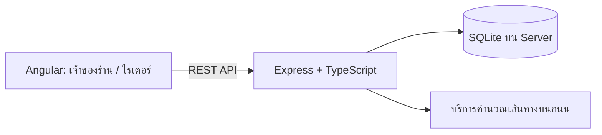

**แบบออกแบบ Backend — ระบบจัดเส้นทางและแบ่งงานไรเดอร์ ส่งด่วนมื้อเที่ยง**

เอกสารนี้ออกแบบสำหรับมินิโปรเจกต์นักศึกษาปี 3 เน้นความเรียบง่าย ทำตามได้จริง และรองรับออเดอร์ประมาณ 20–30 รายการต่อวัน

แนะนำ **Node.js + Express + TypeScript + SQLite โดยใช้ backend แอปเดียว** เพราะทำ CRUD ได้ตรงไปตรงมา และแยกอัลกอริทึมจัดเส้นทางออกมาเป็นไฟล์เดียวให้ทดสอบง่าย

Express รองรับการแบ่ง API เป็นกลุ่มผ่าน Router ส่วน SQLite เก็บฐานข้อมูลเป็นไฟล์ **บนเครื่อง Server** ซึ่งเหมาะกับงานขนาดเล็กและงานสอน โดย Angular ติดต่อฐานข้อมูลผ่าน backend เท่านั้น ([Express](https://expressjs.com/en/guide/using-middleware/), [SQLite](https://www.sqlite.org/whentouse.html))



**ควรกำหนดกติกาของระบบก่อนเขียนโค้ด** เพื่อให้ผลคำนวณตรงกับโจทย์:

- 1 ออเดอร์มีอาหาร 1–3 กล่อง
- 1 ใบงานมีไม่เกิน 3 ออเดอร์ จึงมีได้สูงสุด 9 กล่อง
- ลูกค้าอยู่ในรัศมี 3 กิโลเมตรจากร้าน
- ไรเดอร์แต่ละคนรับ 1 ใบงาน และออกจากร้านพร้อมกันเวลา 11:30 น.
- ต้องส่งมอบอาหารครบภายใน 12:30 น.
- เริ่มต้นให้นับระยะทางจากร้านถึงลูกค้าคนสุดท้าย หากต้องคิดขากลับร้าน ให้เพิ่มเป็นค่าตั้งของระบบ
- กำหนดเวลาส่งมอบเริ่มต้น 2 นาทีต่อจุด และเผื่อเวลา 5 นาที ตัวเลขสองค่านี้เป็นสมมติฐานที่ปรับได้
- วันที่และเวลาที่ใช้แสดงผลอ้างอิงเขตเวลา `Asia/Bangkok`

**ฐานข้อมูลใช้ 6 ตารางก็เพียงพอ** โดยยังไม่ต้องมีระบบสมัครสมาชิกไรเดอร์ เพราะโจทย์ให้เข้าด้วยเลขใบงานอยู่แล้ว

| ตาราง | ข้อมูลสำคัญ | ใช้ทำอะไร |
|---|---|---|
| `users` | `id`, `username`, `password_hash` | บัญชีเจ้าของร้าน |
| `customers` | `id`, `name`, `phone`, `address`, `lat`, `lng`, `is_active` | ข้อมูลลูกค้าและตำแหน่งบ้าน |
| `orders` | `id`, `customer_id`, `delivery_date`, `quantity`, `status`, `version` | ออเดอร์ของแต่ละวัน |
| `delivery_plans` | `id`, `delivery_date`, `departure_at`, `deadline_at`, `status`, `settings_json` | แผนแต่ละรอบที่คำนวณ |
| `delivery_jobs` | `id`, `plan_id`, `job_code`, `color`, `total_boxes`, `distance_m`, `delivery_cost`, `geometry_json` | ใบงานของไรเดอร์แต่ละคน |
| `delivery_stops` | `id`, `job_id`, `order_id`, `sequence`, `estimated_delivery_at`, `snapshot_json` | จุดส่งเรียงตามลำดับ |

ความสัมพันธ์หลักคือ ลูกค้าหนึ่งคนมีหลายออเดอร์ → แผนหนึ่งมีหลายใบงาน → ใบงานหนึ่งมีหลายจุดส่ง

`snapshot_json` เก็บสำเนาชื่อ เบอร์โทร พิกัด และจำนวนกล่องตอนสร้างแผน เพื่อให้ใบงานเก่ายังคงข้อมูลเดิมเมื่อมีการแก้ไขข้อมูลลูกค้า ส่วน `settings_json` เก็บราคา ต้นทุน ความเร็ว และสูตรค่าส่งที่ใช้คำนวณแผนนั้น

แนะนำเก็บเงินเป็นจำนวนเต็มหน่วยสตางค์ และระยะทางเป็นเมตร แล้วแปลงหน่วยตอนแสดงผล

สถานะเริ่มต้นที่ใช้ได้:

- ออเดอร์: `PENDING`, `ASSIGNED`, `CANCELLED`
- แผน: `DRAFT`, `CONFIRMED`

กำหนด `job_code` ให้ไม่ซ้ำ และ `sequence` ให้ไม่ซ้ำภายในใบงานเดียวกัน ส่วนลูกค้าที่มีประวัติออเดอร์ให้ปิดใช้งานแทนการลบข้อมูลถาวร

**API หลักออกแบบได้ประมาณนี้** ทุก API ของเจ้าของร้านต้องผ่านการเข้าสู่ระบบ

| Method / URL | หน้าที่ |
|---|---|
| `POST /api/auth/login` | เจ้าของร้านเข้าสู่ระบบ |
| `GET /api/customers` | ดูรายการลูกค้า |
| `POST /api/customers` | เพิ่มลูกค้า |
| `PATCH /api/customers/:id` | แก้ไขข้อมูลลูกค้า |
| `DELETE /api/customers/:id` | ปิดใช้งานลูกค้า |
| `GET /api/orders?date=YYYY-MM-DD` | ดูออเดอร์ตามวันที่ |
| `POST /api/orders` | เพิ่มออเดอร์ |
| `PATCH /api/orders/:id` | แก้ไขออเดอร์ที่ยังไม่ได้มอบหมาย |
| `DELETE /api/orders/:id` | ยกเลิกออเดอร์ที่ยังไม่ได้มอบหมาย |
| `POST /api/orders/simulate` | สร้างออเดอร์ทดสอบจากลูกค้าที่มีอยู่ |
| `POST /api/plans` | คำนวณแผนใหม่และบันทึกเป็นฉบับร่าง |
| `GET /api/plans/:id` | ดูเส้นทาง ใบงาน และค่าใช้จ่าย |
| `POST /api/plans/:id/confirm` | ยืนยันแผนและเปิดใบงานให้ไรเดอร์ |
| `POST /api/rider/jobs/lookup` | กรอกเลขใบงานเพื่อดูงานของตัวเอง |

ผลจาก `GET /api/plans/:id` ควรมีข้อมูลสองส่วน:

- **ภาพรวม:** จำนวนออเดอร์ กล่อง ไรเดอร์ ระยะทางรวม รายได้ ต้นทุนอาหาร ค่าส่ง กำไรประมาณการ และเวลาส่งเสร็จ
- **รายใบงาน:** สีเส้นทาง จำนวนกล่อง ลำดับจุดส่ง เวลาส่งมอบแต่ละจุด และเส้นทางสำหรับวาดบนแผนที่

ไรเดอร์จะเห็นเฉพาะใบงานของตัวเองที่ยืนยันแล้ว พร้อมชื่อ เบอร์โทร จำนวนกล่อง และพิกัดของแต่ละจุด ให้ Angular สร้างปุ่มเปิดแผนที่นำทางจากพิกัดเหล่านี้ได้

เลขใบงานควรเป็นรหัสสุ่มที่เดายาก มีวันหมดอายุ และจำกัดจำนวนครั้งในการค้นหา เพื่อป้องกันการไล่เดาใบงานของคนอื่น

**อัลกอริทึมแนะนำคือ “เริ่มแยกงาน แล้วรวมงานที่ช่วยประหยัดที่สุด”** หรือ Greedy Merge ซึ่งอธิบายในรายงานและเขียนเองได้ง่าย:

1. เริ่มจาก 1 ออเดอร์ต่อ 1 ใบงาน
2. ทดลองรวมใบงานสองใบ โดยรวมแล้วต้องไม่เกิน 3 ออเดอร์
3. ลองลำดับส่งทุกแบบในกลุ่มนั้น เช่น 3 ออเดอร์มีเพียง `3! = 6` แบบ
4. ตัดลำดับที่ส่งไม่ทันออก แล้วเลือกลำดับที่ค่าส่งต่ำที่สุด
5. คำนวณเงินที่ประหยัดจากการรวมงาน:

   ```text
   เงินที่ประหยัด = ค่าส่งสองใบเดิม − ค่าส่งใบที่รวม
   ```

6. รวมคู่ที่ประหยัดมากที่สุด แล้วทำซ้ำจนไม่มีคู่ที่รวมแล้วถูกลง
7. ตรวจผลสุดท้ายว่าออเดอร์ครบทุกออเดอร์ ไม่ซ้ำ และทุกใบงานผ่านเงื่อนไขเวลา

ถ้าออเดอร์ใดไม่มีเส้นทางที่ส่งทันแม้แยกเป็นใบงานเดี่ยว ให้แจ้งเจ้าของร้านว่าแผนยังไม่ผ่านเงื่อนไข และไม่เปิดให้ยืนยันแผนที่ส่งไม่ครบ

**อย่าบังคับให้ทุกไรเดอร์รับครบ 3 ออเดอร์** เพราะสูตรค่าส่งของโจทย์ทำให้การแยกงานบางครั้งถูกกว่าการรวมงาน:

```text
ค่าส่งต่อใบงาน
= 15 + (2 × จำนวนกล่องทั้งหมดในใบงาน × ระยะทางเป็นกิโลเมตร)

กำไรประมาณการก่อนค่าใช้จ่ายอื่น
= รายได้ − ต้นทุนอาหาร − ค่าส่งทุกใบงาน
```

ตัวอย่าง รับ 6 กล่อง วิ่ง 2 กิโลเมตร:

```text
รายได้       = 6 × 65           = 390 บาท
ต้นทุนอาหาร  = 6 × 40           = 240 บาท
ค่าส่ง       = 15 + (2 × 6 × 2) = 39 บาท
กำไรประมาณการ                  = 111 บาท
```

ตามสูตรนี้ **24 บาทเป็นค่าระยะทางรวมของรอบนั้น** และต้องบวกค่าเรียก 15 บาท จึงเป็นค่าส่งรวม 39 บาท

วิธี Greedy Merge เป็นการหาคำตอบที่ดีด้วยขั้นตอนง่าย ๆ จึงควรอธิบายว่าเป็น **แผนที่ระบบแนะนำเพื่อลดต้นทุน** ไม่รับรองว่าถูกที่สุดในทุกกรณี หากต้องการเพิ่มคุณภาพภายหลัง ค่อยเพิ่มการย้ายหรือสลับออเดอร์ระหว่างใบงาน

**ระยะทางและเวลาให้คำนวณบน backend** โดยดึงระยะทางระหว่างร้านกับลูกค้า และระหว่างลูกค้าแต่ละคู่มาเก็บเป็นตาราง แล้วนำกลับมาใช้ระหว่างทดลองจัดกลุ่ม จะช่วยลดการเรียกบริการแผนที่ซ้ำ

ใช้ OSRM เป็นตัวอย่างได้ เพราะมี Table API สำหรับระยะทางระหว่างหลายจุด และ Route API สำหรับเส้นทางแบบ GeoJSON ที่ส่งให้ Angular วาดแยกสีได้ ทั้งนี้ระยะทางของ OSRM Table เป็นระยะตามเส้นทางที่เร็วที่สุดของบริการ ไม่จำเป็นต้องสั้นที่สุดเสมอ ([OSRM API](https://project-osrm.org/docs/v5.24.0/api/))

ตามสมมติฐานความเร็ว 30 กม./ชม.:

```text
เวลาเดินทาง = ระยะทางกิโลเมตร × 2 นาที
เวลาส่งครบ  = เวลาเดินทาง + เวลาส่งมอบทุกจุด
```

ตรวจเวลาส่งมอบสะสมทุกจุด และเมื่อเผื่อ 5 นาที ให้แผนตั้งเป้าส่งครบภายใน 12:25 น. เวลาที่แสดงยังเป็นค่าประมาณตามสมมติฐานนี้

เพราะไรเดอร์ออกพร้อมกัน **เวลาส่งเสร็จทั้งร้านคือเวลาของใบงานที่เสร็จช้าที่สุด** ส่วนระยะทางและค่าส่งให้นำทุกใบงานมาบวกกัน

หากเริ่มพัฒนาด้วยระยะทางเส้นตรงจากพิกัด ให้ระบุว่าเป็นโหมดจำลอง เพราะเส้นตรงไม่สะท้อนถนนจริง หากบริการเส้นทางขัดข้อง ให้แจ้งข้อผิดพลาดหรือแสดงชัดเจนว่าผลลัพธ์เป็นข้อมูลจำลอง

**ปุ่มคำนวณใหม่ควรสร้างแผนฉบับร่างอีกเวอร์ชัน** เจ้าของร้านจึงเปรียบเทียบค่าใช้จ่ายและเวลาได้ ก่อนเลือกยืนยันหนึ่งแผน วิธีเดิมอาจให้คำตอบเดิมได้ หากต้องการทางเลือก ให้ทดลองเปลี่ยนลำดับการเลือกคู่รวมงาน แล้วเก็บแผนที่แตกต่างกันไว้เปรียบเทียบ

ตอนยืนยันแผน ให้ backend ตรวจว่าออเดอร์และข้อมูลต้นทางยังตรงกับตอนคำนวณ และบันทึกการยืนยันพร้อมเปลี่ยนสถานะออเดอร์ใน transaction เดียว เพื่อป้องกันงานซ้ำ หากข้อมูลเปลี่ยนแล้ว ให้ตอบ `409 Conflict` และให้คำนวณใหม่

สำหรับขอบเขตเริ่มต้น ให้มีแผนที่ยืนยันได้หนึ่งแผนต่อวัน และไม่แก้ไขออเดอร์ที่มอบหมายแล้วผ่าน API แก้ไขออเดอร์ทั่วไป

หากกำไรยังติดลบ ให้แสดงตามจริงพร้อมคำเตือน เพราะการคำนวณใหม่ไม่ได้รับประกันว่าจะทำให้มีกำไร

โครงสร้างไฟล์เริ่มต้นใช้แค่นี้ได้:

```text
backend/
  src/
    app.ts
    db.ts
    routes/
      auth.routes.ts
      customers.routes.ts
      orders.routes.ts
      plans.routes.ts
      rider.routes.ts
    services/
      planner.service.ts
      routing.service.ts
      pricing.service.ts
    middleware/
      auth.middleware.ts
      error.middleware.ts
  sql/
    schema.sql
    seed.sql
```

หน้าที่ของไฟล์ service แยกเป็น:

- `planner.service.ts`: แบ่งกลุ่มออเดอร์ เรียงจุดส่ง และตรวจข้อจำกัด
- `routing.service.ts`: เรียกบริการเส้นทาง จัดการระยะทางระหว่างจุด และดึง GeoJSON
- `pricing.service.ts`: คำนวณรายได้ ต้นทุนอาหาร ค่าส่ง และกำไรประมาณการ

ใช้ parameterized queries ในการอ่านและเขียนฐานข้อมูล ตรวจจำนวนกล่องให้เป็นจำนวนเต็ม 1–3 และตรวจพิกัดก่อนบันทึก โดยเก็บรหัสผ่านเป็น hash

เริ่มทำตามลำดับ **CRUD ลูกค้าและออเดอร์ → สูตรค่าส่ง → จัดกลุ่มและเรียงจุดส่ง → แผนที่ → ยืนยันแผนและหน้าไรเดอร์**

เกณฑ์ทดสอบหลักก่อนส่งโปรเจกต์:

- มี 30 ออเดอร์แล้วทุกออเดอร์ต้องอยู่ในแผนครบหนึ่งครั้ง
- ทุกใบงานต้องมีไม่เกิน 3 ออเดอร์ และจำนวนกล่องต้องตรงกับผลรวมของออเดอร์
- ตัวอย่าง 6 กล่อง ระยะทาง 2 กิโลเมตร ต้องคิดค่าส่งได้ 39 บาท
- แผนต้องผ่านเงื่อนไขเวลาส่งมอบ และแสดงเวลาส่งเสร็จทั้งร้านจากใบงานที่เสร็จช้าที่สุด
- แก้ไขออเดอร์หลังคำนวณแล้ว ต้องยืนยันแผนเดิมไม่ได้จนกว่าจะคำนวณใหม่
- ยืนยันแผนซ้ำต้องไม่สร้างใบงานหรือมอบหมายออเดอร์ซ้ำ
- ไรเดอร์ต้องค้นหาได้เฉพาะใบงานที่ยืนยันแล้ว โดยเลขใบงานผิดหรือหมดอายุไม่เปิดเผยข้อมูลลูกค้า
- กรณีไม่มีออเดอร์ต้องแสดงผลว่างได้ และกรณีไม่มีเส้นทางที่ส่งทันต้องแจ้งให้เจ้าของร้านทราบ
